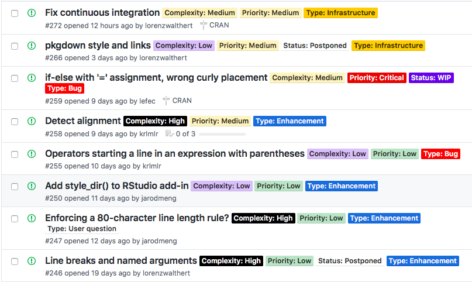

Labelling Strategy
================
Lorenz Walthert
11/3/2017

Overview
========

This documentation outlines the labelling strategy that was used for dealing with issues. It was inspired by [this](https://medium.com/@dave_lunny/sane-github-labels-c5d2e6004b63) blog post. There are four types of categories used to label issues.

-   Type
-   Status
-   Complexity
-   Priority

That may then look like this. 

The colors of the labels were chosen such that dark / red corresponds to urgent / complex etc, whereas bright / green etc. corresponds to not urgent / simple and so on.

Labels should be assigned to issues as soon as possible.

In the next section, we will introduce every category in detail and descending order.

Type
====

Type describes the type of the issue, it can be one of the following:

-   Bug: Everything ranging from unexpected behavior to faulty behavior.
-   Enhancement: An issue that relates to adding a feature to the project that results in an API change.
-   Infrastructure: Similar to Enhancement, but this refers to internal changes and re-factoring, maintenance etc. rather than to API changes that affect the user experience.
-   User Question: Questions from users that are not really any of the above, but rather just need clarification on the project.
-   Unassigned: No type assigned yet.

Status
======

Status describes the status of the issue, it can be one of the following:

-   WIP: This is work in progress from some contributor and hence, it does not make sense for other people to also work on it.
-   Postponed: The issue was postponed, so it should not be expected to be resolved in the near future. **Postponed issues are closed, even though they are not solved.**
-   Unassigned: No status assigned yet.

Priority
========

Priority describes the relevance of the issue, it can be one of the following:

-   Critical: This issue is really pressing and affects the functionality of the project in a substantial fashion. It needs to be solved as soon as possible.
-   High: Issue is urgent.
-   Medium: Not so urgent.
-   Low: This is a detail and does not affect the main functionality of the project.
-   Unassigned: No priority assigned yet.

Complexity
==========

Complexity describes the complexity of the issue, it can be one of the following:

-   High: Very complex issue that involves different aspects of the project that need to be re-factored to solve the issue. Very time-consuming and difficult to solve. Requires large background knowledge of the project.
-   Medium: Might bear some complexity, time needed to solve this can be anticipated.
-   Low: Almost trivial problem, can be resolved very quickly and without much knowledge of the project.
-   Unassigned: No complexity assigned yet.

Meta
====

Meta describes meta aspects of the issue, it can be one of the following:

-   Duplicate.
